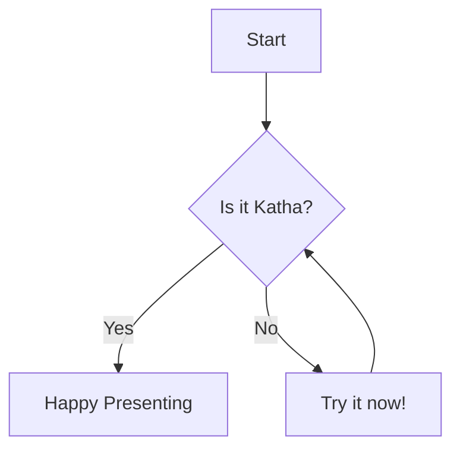

# Welcome to Katha

The developer-first presentation system.

<span className="text-gray-400">Press Arrow Keys to Navigate</span>

---slide---

# Why Katha?

*   **Markdown Based**: Write slides in your favorite editor.
*   **React Components**: Import and use React components directly.
*   **Themable**: Built with Tailwind CSS.
*   **Developer Friendly**: Code highlighting, Hot Module Reloading.

---slide---

# Table of Contents

<Toc />

---slide---
---
id: click-reveal-demo
clicks: 3
---

# Click to Reveal ✨

<ClickReveal at="1">First, we set up the project.</ClickReveal>

<ClickReveal at="2">Then, we write our slides in Markdown.</ClickReveal>

<ClickReveal at="3">Finally, we present!</ClickReveal>

<p className="text-gray-400 text-sm mt-8">Press → or Space to reveal each step</p>

---slide---
---
clicks: 3
---

# Lists Reveal

Reveal list items one by one easily using `<RevealList>`.

<RevealList>
- ✨ Supports markdown lists
- 🔄 Automatic step incrementing
- 📦 Works with nested components
</RevealList>

---slide---
---
layout: split
id: layouts-demo
---

# Layouts

Katha supports different layouts.

This is the **Split Layout**. It allows you to put content on the left...

::right::

# ...and content on the right.

Perfect for comparisons or code explanations.

---slide---
---
id: architecture-deep-dive
theme: neon
---

# Code Highlighting

Katha uses Shiki for beautiful code highlighting.

```javascript

// Example Code
function hello() {
  console.log("Hello Katha!");
}

```

---slide---

# Code Highlighting

Katha uses Shiki for beautiful code highlighting.

```ts {1,3-4}
// Line highlighting demo 💡
const x = 1; // Highlighted
const y = 2; // Not highlighted
const z = 3; // Highlighted
const w = 4; // Highlighted
```


---slide---

# Diagrams with Mermaid

Create architecture diagrams or flowcharts using simple text.



---slide---

# Interactive Components

You can embed React components directly in your markdown!

<Card className="w-96 bg-slate-800 text-white border-none">
  <CardHeader>
    <CardTitle>Interactive Card</CardTitle>
  </CardHeader>
  <CardContent>
    <Button>Click Me</Button>
  </CardContent>
</Card>

---slide---

# Animations

Bring your slides to life with component-based animations.

<div className="flex gap-4">
    <AnimatedComponent animation="bounce">Bouncing</AnimatedComponent>
    <AnimatedComponent animation="pulse" duration={1}>Pulsing</AnimatedComponent>
    <AnimatedComponent animation="spin" className="bg-gradient-to-r from-red-500 to-orange-500 rounded-full w-24 h-24 flex items-center justify-center">Spinning</AnimatedComponent>
</div>

---slide---
---
layout: quote
class: bg-gradient-to-r from-purple-900 to-indigo-900 text-white
---

> "The best way to predict the future is to invent it." – Alan Kay

---slide---
---
layout: section
background: linear-gradient(135deg, #667eea 0%, #764ba2 100%)
---

# Part 2: Advanced Features

---slide---
---
layout: image-left
image: https://images.unsplash.com/photo-1516321318423-f06f85e504b3?w=800
id: image-left-demo
---

# Image Left Layout

The `image-left` layout displays an image on the left side of the slide with content on the right.

Use the `image` frontmatter to set the background image URL.

---slide---
---
layout: image-right
image: https://images.unsplash.com/photo-1498050108023-c5249f4df085?w=800
id: image-right-demo
---

# Image Right Layout

The `image-right` layout displays content on the left with an image on the right side.

Perfect for showcasing products, screenshots, or visual content alongside explanatory text.

---slide---
---
layout: title
---

# Ready to Start?

Run:
`katha my-presentation.md`

[Documentation](https://github.com/algoben-inc/katha)


---slide---
---
transition: fade
---

# Smooth Transitions

This slide uses a **fade** transition!
Katha supports `slide`, `fade`, and `zoom`.

---slide---
---
transition: zoom
style:
  background: 'linear-gradient(135deg, #667eea 0%, #764ba2 100%)'
---

# Zoom & Custom Styles

This slide uses **zoom** and a custom CSS gradient background via the `style` frontmatter.

---slide---
---
slideNumber: false
---

# The End

Thank you for using Katha!
Slide numbers are hidden here for a cleaner look.
Try right-clicking anywhere to see the Context Menu.
